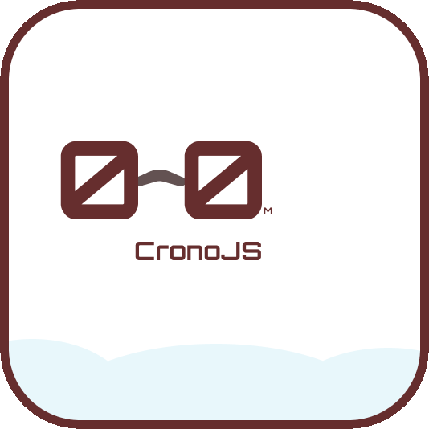

# CronoJS - Projeto de Treino

CronoJS é um cronômetro simples e fácil de usar, desenvolvido com HTML, CSS e JavaScript como projeto de treino. Com CronoJS, você pode medir o tempo de qualquer atividade com facilidade, seja uma corrida, uma apresentação ou um jogo.

## Recursos

CronoJS inclui os seguintes recursos:

- Cronômetro com contagem regressiva de horas, minutos e segundos
- Botões de controle para iniciar, pausar e resetar o cronômetro
- Interface simples e fácil de usar, com um design limpo e moderno

## Como usar

Para usar CronoJS, basta abrir o arquivo "index.html" em seu navegador e clicar no botão "Iniciar" para começar a contagem do tempo. Você pode pausar o cronômetro a qualquer momento clicando no botão "Pausar" e resetar a contagem clicando no botão "Resetar".

## Personalização

CronoJS é altamente personalizável, permitindo que você ajuste as cores, fontes e outros aspectos visuais do cronômetro. O código-fonte está disponível para download em [http://github.com/gabriellicar/cronojs](http://github.com/gabriellicar/cronojs), permitindo que você faça modificações e adaptações para atender às suas necessidades específicas.

## Suporte

Este projeto é um exercício de treino. Se você tiver alguma dúvida ou encontrar algum problema com CronoJS, sinta-se à vontade para entrar em contato comigo em ``paulogabrielicar@gmail.com`` para obter suporte e assistência.

## Conclusão

CronoJS é uma ótima opção para quem procura um cronômetro simples e funcional para suas atividades diárias. Com seu design limpo e moderno e sua interface fácil de usar, CronoJS é a escolha perfeita para medir o tempo de qualquer atividade com precisão e facilidade.
